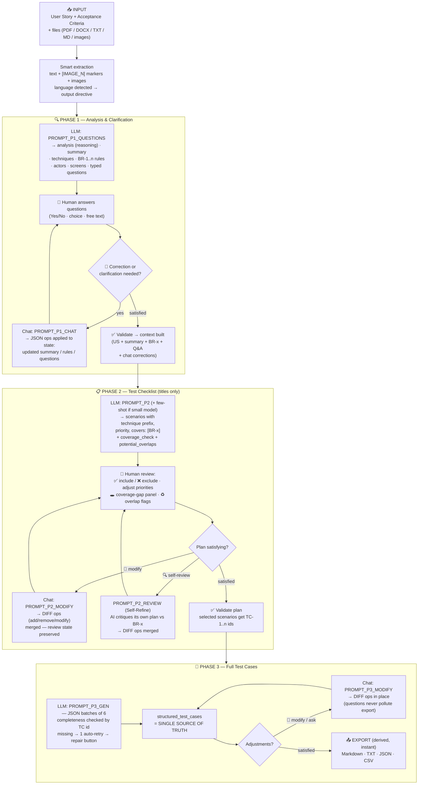

# 🧪 QAForge — AI Test Case Generator

**Version 0.8**
**QAForge** is a web application that automatically generates professional, structured QA test cases from a user story or feature description, using AI.

---

## ✨ Features

- **Dark design system**: JetBrains Mono + Inter, calibration-ruler stepper, accordion TC cards with priority/technique/automation pills
- **UX improvements**: session status in sidebar, confirmation before new session, ETA during generation, token warning before submit, progress bar always visible
- **Session Settings (modal)**: company context injection + fully configurable output schema (priorities, optional fields) — session-only, no file writes
- **5 LLM providers**: Gemini, OpenAI, Groq, Mistral, OpenRouter
- **Multi-file upload**: PDF (text + images), DOCX (paragraphs + tables + images), TXT, MD, direct images (max 5 files)
- **Smart extraction**: PDF via PyMuPDF (positional order), DOCX with Markdown tables, `[IMAGE_N — file]` markers
- **Image resizing**: images auto-resized to max 1024px before API call (reduces cost and latency)
- **3 structured phases** with locked navigation and progress tracking
- **Coverage traceability**: numbered business rules (BR-x) mapped to scenarios — uncovered rules are flagged
- **Diff-based iterations**: chat modifications apply add/remove/modify operations — human review work (✅/❌, priorities) is never lost
- **AI self-review** (Self-Refine pattern): one click makes the AI critique its own checklist against the business rules (coverage, duplicates, title quality) and apply improvements as a diff
- **Self-flagged overlaps**: the AI declares potentially duplicate scenarios (`potential_overlaps`) so human consolidation is targeted, not blind
- **Deterministic output language**: input language is detected in code (langdetect) and injected as an explicit directive — no more language drift on smaller models
- **Provider-aware prompting**: a few-shot example is appended only for smaller models (Groq/Mistral/OpenRouter); Gemini/OpenAI stay zero-shot (research shows few-shot can degrade strong models)
- **JSON-first test cases**: structured data is the single source of truth — MD/CSV/JSON exports are derived from it and always consistent
- **Export**: Markdown · JSON · CSV (instant, no extra LLM call)
- **Temperature slider**: 0.0 → 1.0 (default 0.2)
- **Auto-retry**: automatic retry with backoff on 429 / rate-limit errors
- **Multilingual**: output language matches the language of the User Story
- **Tooltips on every phase button** — technique glossary and phase guidance built in

---

## 🗺️ The 3 Phases

### Phase 1 — Analysis & Clarification

The AI analyzes the User Story and:

1. Identifies **applicable test design techniques** (ISO 29119-4 specification-based + experience-based) before generating anything
2. Generates **typed clarifying questions** (boolean / multiple_choice / text) grouped by category (Functional, Validation, Error Handling, Edge Cases, System Dependencies)
3. Displays an analysis panel: numbered business rules (BR-1, BR-2…), actors, identified screens, techniques with rationale
4. The clarification chat **applies corrections to the analysis** (summary, business rules, new questions) — corrections actually reach Phase 2, and the chat transcript is injected into the Phase 2 context

### Phase 2 — Test Checklist

The AI generates a test checklist per technique:

- Each scenario is prefixed by its technique: `BVA —`, `DT —`, `ST —`, `EP —`, `FC —`, `EG —`, `ET —`
- Each scenario declares the business rules it covers (`covers: BR-1, BR-3`) — a **coverage panel** flags any rule not covered by a selected scenario
- Per-scenario validation ✅ / rejection ❌ / priority adjustment
- Chat modifications are applied as a **diff** (add / remove / modify) — your review state is preserved across iterations

### Phase 3 — Full Test Cases & Export

The AI writes execution-ready test cases **directly as structured JSON** (batches of 6, completeness verified per pre-assigned TC id — missing scenarios are retried, then surfaced with a targeted "regenerate missing" repair):

- **Accordion cards**: each TC is a clickable card with priority/technique/automation pills — no more wall of markdown
- **Summary grid**: total TCs, BR coverage, automation ratio, estimated manual run time
- **Technique** field (test design traceability)
- Real test data in steps
- Expected result in natural language
- Chat modifications apply **in place** (questions are answered without polluting the export)
- MD / TXT / JSON / CSV export — all derived from the same structured data, available instantly

> ⚠️ ISO 29119-4 coverage techniques favour exhaustiveness — a human review pass to remove duplicates is normal and expected.

---

## 🔄 How it works — end-to-end process



### State & source of truth per phase

Each phase owns ONE canonical structured object. The UI and all exports are **derived** from it; every mutation goes through the same tested merge functions.

| Phase | Source of truth (session state)                                                             | Mutated by                                                                          | Derived from it                                                                  |
| ----- | ------------------------------------------------------------------------------------------- | ----------------------------------------------------------------------------------- | -------------------------------------------------------------------------------- |
| 1     | `p1_summary`, `p1_business_rules` (BR-x), `p1_questions`, `p1_answers`, `p1_iso_techniques` | Initial analysis · chat ops (`PROMPT_P1_CHAT`) · human answers                      | Phase 2 context (`p1_context`)                                                   |
| 2     | `p2_scenarios` (+ `covers`) and `p2_review` (✅/❌ + priority per id)                       | Initial generation · chat diff (`apply_scenario_ops`) · AI self-review (same merge) | Coverage-gap panel · overlap flags · validated plan with pre-assigned `TC-n` ids |
| 3     | `structured_test_cases` (JSON list)                                                         | Batch generation · targeted repair of missing ids · chat diff (`apply_tc_ops`)      | On-screen Markdown (`tc_to_markdown`) · MD/TXT/JSON/CSV exports (`build_csv`)    |

Phase transitions enforce coherence: re-validating Phase 1 **regenerates Phase 2 and resets Phase 3**; validating Phase 2 resets the Phase 3 chat. `phase_reached` never goes backwards (tabs stay unlocked).

### Prompt map

| Prompt                                                               | Called when                        | Output contract                                                                                                                         | Applied by               |
| -------------------------------------------------------------------- | ---------------------------------- | --------------------------------------------------------------------------------------------------------------------------------------- | ------------------------ |
| `PROMPT_P1_QUESTIONS`                                                | User Story submitted               | JSON: `analysis` (reasoning scratchpad, discarded) → summary, techniques, `key_business_rules` (BR-x), actors, screens, typed questions | direct state assignment  |
| `PROMPT_P1_CHAT`                                                     | Phase 1 chat message               | JSON: `reply` + optional `updated_summary` / `updated_business_rules` / `new_questions` (plain-text fallback)                           | state update             |
| `PROMPT_P2` (+ `PROMPT_P2_FEWSHOT` for Groq/Mistral/OpenRouter only) | Phase 1 validated                  | JSON: summary, scenarios (`covers`), `coverage_check` (self-verification, ordered AFTER scenarios on purpose), `potential_overlaps`     | `normalize_scenarios`    |
| `PROMPT_P2_MODIFY`                                                   | Phase 2 chat message               | JSON diff: `reply` + `add` / `remove` / `modify` — ambiguous request ⇒ clarifying question, empty ops                                   | `apply_scenario_ops`     |
| `PROMPT_P2_REVIEW`                                                   | "AI self-review" button            | Same diff contract — the model critiques its own plan (coverage, duplicates, title quality)                                             | `apply_scenario_ops`     |
| `PROMPT_P3_GEN`                                                      | Phase 2 validated (per batch of 6) | JSON: `test_cases` keeping exact `id`/`title`/`priority`/`covers`, optional per-step `expected`                                         | completeness check by id |
| `PROMPT_P3_MODIFY`                                                   | Phase 3 chat message               | JSON diff: `reply` + `add` / `remove` / `modify` — pure questions ⇒ empty ops                                                           | `apply_tc_ops`           |

### LLM call pipeline

```
                         ┌─ Gemini ──── native vision + JSON mime-type
user message ──┬─ call_llm ───────┤  (history + images — Phase 1 analysis & chat)
(language      │                  └─ OpenAI-compatible (OpenAI/Groq/Mistral/OpenRouter)
 directive     │
 prepended     └─ call_llm_json ──┬─ Gemini: response_mime_type=application/json
 in code)                         ├─ OpenAI: response_format=json_object
                                  └─ others: instruction-based JSON
                 every path → _retry (3 attempts, backoff on 429)
                 every JSON path → extract_json (fence/preamble tolerant)
                 API errors (401/404/429) are RAISED to handle_error — never
                 silently swallowed into a fallback call
```

Two design rules worth knowing when modifying the app: **(1)** never bypass `apply_scenario_ops` / `apply_tc_ops` when mutating plans or test cases — they are what preserves human review state and id uniqueness; **(2)** never write to `p3_full_md`-style derived text — render from `structured_test_cases` instead.

---

## 📄 Configuration files

Two files at the repo root control permanent defaults (overridable per-session in Settings):

| File | Purpose |
|---|---|
| `context.md` | Company/product context injected into AI prompts. Comment lines (`#`, `<!--`) are stripped before injection. Keep under 2000 chars. |
| `output_schema.json` | Priority labels/emojis and optional field toggles. See the Settings section above for the full schema. |

Both files are loaded once at startup via `@st.cache_resource`. Modifying them requires an app restart (or clearing the cache) — use the Settings modal for session-only changes.

---

## 🚀 Installation

### Requirements

```bash
pip install -r requirements.txt
```

Or manually:

```bash
pip install -r requirements.txt   # versions are PINNED for reproducible deploys
```

### Run the app

```bash
streamlit run app.py
```

---

## ⚙️ Configuration

### Settings modal

Click **⚙ Settings** at the top of the sidebar to open the modal. Changes apply to the current session only — nothing is written to disk.

**Company Context** — free-text description of your product, domain vocabulary, naming conventions, and global business rules. Injected into Phase 1, Phase 2, and Phase 3 prompts to ground generation in your domain. Edit `context.md` for permanent defaults.

**Output Schema** — editable JSON with two sections:

```json
{
  "priorities": [
    {"label": "Very High", "emoji": "🔴"},
    {"label": "High",      "emoji": "🟠"},
    {"label": "Medium",    "emoji": "🟡"},
    {"label": "Low",       "emoji": "🟢"}
  ],
  "optional_fields": {
    "technique":         true,
    "type":              true,
    "automation":        true,
    "preconditions":     true,
    "failure_signature": true
  }
}
```

- **priorities**: define as many or as few levels as you want (3 is common). Labels and emojis cascade automatically through Phase 2 buttons, prompts, filters, pills, and Testmo export — nothing hardcoded.
- **optional_fields**: set to `false` to remove a field entirely from generated TCs, cards, exports, and prompts. Mandatory fields (`id`, `title`, `steps`, `expected_result`, `covers`) cannot be disabled.

| Optional field | What it adds | Disable when |
|---|---|---|
| `technique` | Test design technique prefix (BVA, EP…) | You don't use ISO 29119-4 traceability |
| `type` | Functional / Non-functional / Security… | Not relevant for your context |
| `automation` | Automatable / Manual tag + ratio in summary | No automation planned |
| `preconditions` | Pre-state required before test execution | Scenarios are always self-contained |
| `failure_signature` | Observable symptom on failure (assertion hint) | No automated assertions planned |

Edit `output_schema.json` for permanent defaults.

### Sidebar parameters

In the **sidebar**:

| Parameter          | Description                                                                                            |
| ------------------ | ------------------------------------------------------------------------------------------------------ |
| **LLM Provider**   | Gemini · OpenAI · Groq · Mistral · OpenRouter                                                          |
| **API Key**        | API key for the selected provider                                                                      |
| **Model**          | Exact model ID (e.g. `gemini-2.5-flash-lite`, `gpt-4o-mini`)                                           |
| **🌡️ Temperature** | `0.0` = reproducible (ISO 29119-4) · `0.2` = balanced default · `>0.5` = creative but less stable JSON |

### Recommended models

| Provider   | Recommended model                        | Notes                                                                                                                   |
| ---------- | ---------------------------------------- | ----------------------------------------------------------------------------------------------------------------------- |
| Gemini     | `gemini-2.5-flash-lite`                  | Most generous free quota (~15 RPM / 1000 RPD), native vision. ⚠️ `gemini-2.0-flash` is deprecated — its free quota is 0 |
| OpenAI     | `gpt-4o-mini`                            | Cost-efficient, reliable structured JSON                                                                                |
| Groq       | `llama-3.3-70b-versatile`                | Very fast, free tier available                                                                                          |
| Mistral    | `mistral-small-latest`                   | Good European alternative                                                                                               |
| OpenRouter | `meta-llama/llama-3.3-70b-instruct:free` | Free but ~50 requests/day and shared capacity — 429 errors can occur even on a first request                            |

---

## 🔬 Test Design Techniques

QAForge applies test design techniques systematically across all 3 phases.

### Technique identification (Phase 1)

Before asking any clarifying question, the AI identifies which techniques apply to the requirements. This ensures test coverage is grounded in the actual feature characteristics — not generated arbitrarily.

### Supported techniques

| Prefix   | Technique                   | Family                                                                 | When applied                                                           |
| -------- | --------------------------- | ---------------------------------------------------------------------- | ---------------------------------------------------------------------- |
| `BVA`    | Boundary Value Analysis     | ISO 29119-4 specification-based                                        | Numeric fields, ranges, limits                                         |
| `DT`     | Decision Table Testing      | ISO 29119-4 specification-based                                        | Multi-condition logic (pairwise preferred when 3+ conditions interact) |
| `ST`     | State Transition Testing    | ISO 29119-4 specification-based                                        | Lifecycles, statuses (draft/active/archived)                           |
| `EP`     | Equivalence Partitioning    | ISO 29119-4 specification-based                                        | Valid/invalid input classes                                            |
| `EG`     | Error Guessing              | ISO 29119-4 experience-based                                           | Likely failure points from experience                                  |
| `ET`     | Exploratory Testing         | Experience-based **practice** (ISTQB — not a 29119-4 design technique) | Unexpected user paths, free-form exploration                           |
| `FC`     | Function Combinations       | Combinatorial (feature interactions)                                   | Interactions between features/modules                                  |
| _(none)_ | Happy Path / Alternate Flow | —                                                                      | Nominal user journeys                                                  |

### Coverage traceability

Phase 1 numbers every business rule (`BR-1`, `BR-2`, …). Phase 2 scenarios declare which rules they cover, and the UI flags **uncovered rules** so coverage is verifiable instead of merely claimed.

### Coverage vs. precision

These techniques are designed to maximise **test coverage (recall)**. This means the generated test suite will be exhaustive but may include overlapping scenarios. A human review pass to consolidate duplicates before execution is recommended.

---

## 📁 Supported file formats

| Format           | Text extraction        | Image extraction      | Notes                                                               |
| ---------------- | ---------------------- | --------------------- | ------------------------------------------------------------------- |
| PDF              | ✅ PyMuPDF             | ✅ (positional order) | Fallback to pypdf if PyMuPDF unavailable · Scanned pages rasterized |
| DOCX             | ✅ paragraphs + tables | ✅ inline images      | Tables converted to Markdown                                        |
| TXT / MD         | ✅                     | ❌                    | Plain text                                                          |
| PNG / JPG / WEBP | —                      | ✅ direct             | Visual analysis (Gemini / OpenAI only)                              |

> **Limits**: 5 files max · Max 80,000 chars per file · Images smaller than 50×50px filtered out · Images resized to max 1024px before API call

---

## 📤 Exports

| Format       | Content                                                                                                                                                            |
| ------------ | ------------------------------------------------------------------------------------------------------------------------------------------------------------------ |
| **Markdown** | Formatted test cases with tables, numbered steps, expected results (derived from JSON)                                                                             |
| **JSON**     | Structured array (source of truth): `id`, `title`, `priority`, `covers`, `steps`, `expected_result` (mandatory) + `technique`, `type`, `automation`, `preconditions`, `failure_signature` (optional — omitted when disabled in schema) |
| **CSV**      | Excel / Google Sheets / Jira compatible — formula-injection safe, includes `covers` (BR-x traceability) and per-step expected results                              |

---

## 🏗️ Architecture

```
app.py
├── File loaders          _load_context_file / _load_schema_file (@st.cache_resource)
├── Session settings      get_priorities() / get_optional_fields() / company_context_block()
│                         _settings_dialog() — st.dialog modal, session-only
├── Image utils           resize_image (max 1024px before API)
├── LLM Adapters          _gemini_client / _openai_client (cached)
│                         call_gemini / call_openai / call_llm (unified router)
│                         call_llm_json (native JSON mode: Gemini mime-type, OpenAI
│                                        response_format; instruction-based otherwise)
│                         extract_json (robust fence/preamble-tolerant parsing)
│                         _retry (auto-retry on 429 / rate-limit errors)
├── File Parsers          pdf_smart_extract / docx_smart_extract / extract_text_plain
├── Generation            generate_test_cases_in_batches (JSON-first, batches of 6,
│                         per-batch completeness check by pre-assigned TC id + retry)
│                         tc_to_markdown (deterministic MD rendering from JSON)
├── Diff helpers          apply_scenario_ops / apply_tc_ops (add/remove/modify merges)
├── Traceability          normalize_rules / coverage_gaps (BR-x ↔ scenarios)
├── HELP_TEXTS            Centralised tooltip strings — edit without touching UI logic
├── Prompts               build_prompt_p2() / build_prompt_p2_fewshot()
│                         build_prompt_p2_modify() / build_prompt_p3_gen()
│                         (all read priorities + optional_fields from session state)
│                         PROMPT_P1_QUESTIONS · PROMPT_P1_CHAT (structured updates)
│                         PROMPT_P2_REVIEW (self-refine diff)
│                         PROMPT_P3_MODIFY (diff)
├── UI helpers            render_stepper (graduation-ruler, components.html)
│                         render_tc_cards (accordion cards, components.html)
│                         render_tc_summary (stats grid, respects optional_fields)
└── UI                    Phase 1 / Phase 2 / Phase 3
```

### Single source of truth (JSON-first)

Phase 3 test cases are generated and stored as **structured JSON**. The on-screen
Markdown and all exports (MD / TXT / JSON / CSV) are **derived deterministically** from
that data — display and exports can never diverge, and no extra LLM call is needed
to export.

### Completeness verification (replaces the completion-token heuristic)

Each scenario receives a pre-assigned id (`TC-1` … `TC-n`) before generation. After each
batch, returned ids are compared with requested ids; missing ones are retried once, and
anything still missing is listed in Phase 3 with a targeted **"Regenerate missing"**
button — no token heuristic, no risk of duplicated content.

### CSV safety

Cells starting with `=`, `+`, `-` or `@` are prefixed with `'` in CSV exports to
neutralise spreadsheet formula injection (Excel / Google Sheets).

### Centralised help texts

All user-visible tooltip strings are stored in the `HELP_TEXTS` dictionary, placed just before `# ── FILE PARSING`. To update any tooltip, edit only this block — no UI logic is touched.

---

## ⚠️ Known limitations

- **Groq, Mistral, OpenRouter** do not support image analysis — `[IMAGE_N]` markers remain in text but are not visually processed
- **Mistral Small** context window (~32k tokens) limits effective document size to ~25,000 chars
- `localStorage` is disabled in Streamlit Cloud iframes — session is lost on page reload
- Streamlit Cloud builds can fail on transient PyPI timeouts (`ReadTimeoutError ... /simple/<pkg>/` then a misleading `ResolutionImpossible`) — reboot the app; pinned requirements keep the resolver from backtracking

---

## Testmo export (optional)

QAForge's core flow is unchanged — Testmo is one more export option at the end
of Phase 3, alongside Markdown / JSON / CSV. Two paths, same source of truth
(`structured_test_cases`), implemented in the standalone module
`testmo_export.py` (Streamlit-free, covered by `test_testmo_export.py`,
25 tests):

- **CSV (import wizard)** — multi-row format (one row per step). In the wizard:
  enable *"A test case can span across multiple rows"*, pick a *Case (steps)*
  template, map *Name* as the case column and *Step / Step Expected* as step
  sub-fields. Technique + BR-x traceability land as **Tags**. File is plain
  UTF-8 (select UTF-8 in the wizard).
- **API push (direct)** — bulk `POST /projects/{id}/cases` (100 per request).
  Templates, priority option IDs and text fields are discovered live from the
  instance (`GET /templates`) — nothing hardcoded. EN/FR priority labels and
  accented field names ("Priorité", "Préconditions") are matched
  accent-insensitively. Payload preview + duplicate-push guard included.

⚠️ For a **company** Testmo instance, run QAForge locally
(`streamlit run app.py`) rather than on Streamlit Cloud, and clear your
internal AI/tooling policy before pasting an API token.

Delete `testmo_export.py` and the app still runs — it is a satellite, not a
dependency.

## ClickUp import (optional)

Input-side satellite (`clickup_import.py`, tested by `test_clickup_import.py`):
fetch a ClickUp task by id or URL and **pre-fill** the User Story field —
never generate directly from a fetch. The QA reviews and enriches the ticket
first: ticket quality drives test quality. Simple scalar custom fields (where
acceptance criteria often live) are included; complex ones are skipped.
Custom task ids (PROJ-123) are supported via the full task URL. Same security
posture as Testmo: session-only token, run locally for company data. Delete
`clickup_import.py` and the app still runs.
